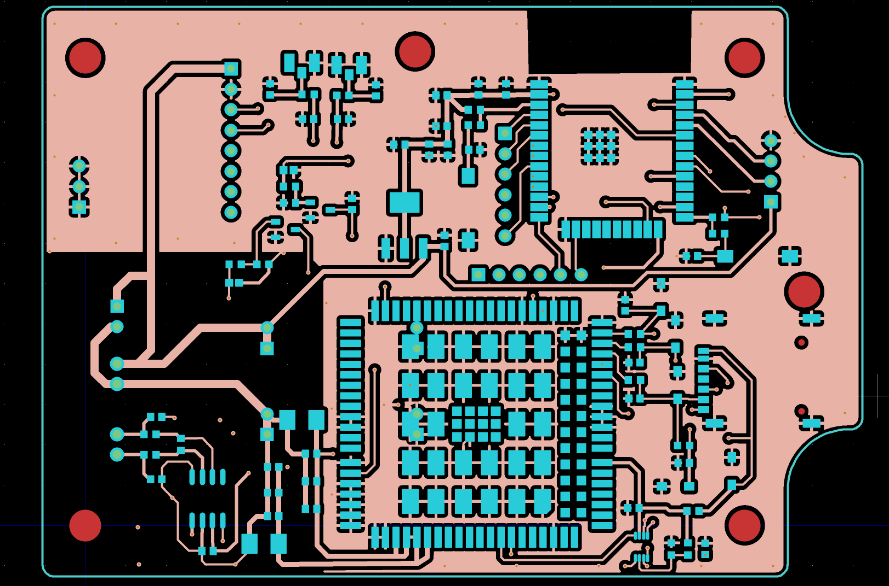

# greentiger-vcu-telemetry-pcb
# Automotive VCU & IoT Telemetry Platform — Green Tiger Mobility

This repository documents PCB design work completed for **automotive vehicle control and telemetry systems**
at **Green Tiger Mobility**, focusing on **schematic ownership, layout discipline, manufacturing readiness,
and bring-up support**.

> ⚠️ IP Notice  
> Full schematic sources, PCB design files, and manufacturing outputs are not shared due to IP constraints.  
> This repository provides **representative PCB visuals and a high-level engineering summary**.

---

## Scope Overview

- Vehicle Control Unit (VCU) and IoT telemetry board development
- Integration of **ESP32 MCU** with **GPS** and **cellular (GSM/4G)** modules
- Automotive power environment support (**12–5 V and 5 - 3.3 rails**) with protection and regulation
- Layout emphasis: **power integrity, return paths, EMI robustness**
- Manufacturing release support (Gerbers/drill/BOM/pick-and-place/fab notes) and bring-up debug

---

## PCB Layout — Top Layer

**What this demonstrates**
- Component placement strategy for mixed-signal + power
- Partitioning between power switching/high-current areas and digital/RF sections
- Routing discipline for UART/I²C and module interconnects

---

## PCB Layout — Bottom Layer

**What this demonstrates**
- Return path planning and copper utilization
- Power/ground integrity practices on constrained stack-ups
- Noise containment and stitching strategy (as applicable)

---

## Tools & Workflow

- **Schematic & PCB**: KiCad (and other professional EDA tools as required)
- **Design practices**: ERC/DRC, DFM/DFA, manufacturing release package generation
- **Bring-up**: staged power validation, interface verification (UART/I²C), debug support

---

## Why this matters

This work reflects **production-oriented PCB ownership** in an automotive environment:
integration of power + compute + communications, layout trade-offs, and delivery to manufacturing
with support through bring-up.
